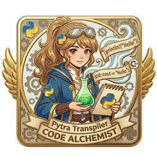

  

    <h1>Pytra</h1>
     is Pytra's input language — Pytra transpiles that code into multiple target languages.

     <code>·  Supported Backends  ·</code>  
    
    
    
    
    
    
    
    
     
    
    
    
    
    
    
    
    
    
    
     

## Features

**🐍 Python → native code in each target language**

- 🌐 Transpiles to C++ / Rust / Go / Java / TS and many more
- 🧩 Preserves the original code structure almost entirely
- ⚡ Write in Python, generate high-performance code
- ✨ Simple Python subset input
- 🛠 Works with existing tools like VS Code out of the box
- 🔧 The transpiler itself is written in Python — easy to extend
- 🔁 Self-hosting capable — can transpile itself

## Performance Comparison

Execution time of sample code written in Python versus execution time of the same code after transpilation. (Unit: seconds.) The Python column is the original code; PyPy is included for reference.

|No.|Description|||||||
|-|-|-:|-:|-:|-:|-:|-:|
|06 |Julia set parameter sweep (GIF)|9.627|0.507|0.546|0.407|0.329|0.626|
|16 |Glass sculpture chaos rotation (GIF)|6.847|0.606|0.277|0.246|1.220|0.650|

Full data for all languages and all samples → [Sample page](sample/README.md#performance-comparison)

<table><tr>
<td valign="top" width="50%">

Sample code : 06_julia_parameter_sweep.py

- Full source: [sample/py/06_julia_parameter_sweep.py](sample/py/06_julia_parameter_sweep.py)

Transpiled code (per language)

[C++](sample/cpp/06_julia_parameter_sweep.cpp) | [Rust](sample/rs/06_julia_parameter_sweep.rs) | [C#](sample/cs/06_julia_parameter_sweep.cs) | [JS](sample/js/06_julia_parameter_sweep.js) | [TS](sample/ts/06_julia_parameter_sweep.ts) | [Dart](sample/dart/06_julia_parameter_sweep.dart) | [Go](sample/go/06_julia_parameter_sweep.go) | [Java](sample/java/06_julia_parameter_sweep.java) | [Swift](sample/swift/06_julia_parameter_sweep.swift) | [Kotlin](sample/kotlin/06_julia_parameter_sweep.kt) | [Ruby](sample/ruby/06_julia_parameter_sweep.rb) | [Lua](sample/lua/06_julia_parameter_sweep.lua) | [Scala3](sample/scala/06_julia_parameter_sweep.scala) | [PHP](sample/php/06_julia_parameter_sweep.php) | [Julia](sample/julia/06_julia_parameter_sweep.jl)

</td>
<td valign="top" width="50%">

Sample code : 16_glass_sculpture_chaos.py

- Full source: [sample/py/16_glass_sculpture_chaos.py](sample/py/16_glass_sculpture_chaos.py)

Transpiled code (per language)

[C++](sample/cpp/16_glass_sculpture_chaos.cpp) | [Rust](sample/rs/16_glass_sculpture_chaos.rs) | [C#](sample/cs/16_glass_sculpture_chaos.cs) | [JS](sample/js/16_glass_sculpture_chaos.js) | [TS](sample/ts/16_glass_sculpture_chaos.ts) | [Dart](sample/dart/16_glass_sculpture_chaos.dart) | [Go](sample/go/16_glass_sculpture_chaos.go) | [Java](sample/java/16_glass_sculpture_chaos.java) | [Swift](sample/swift/16_glass_sculpture_chaos.swift) | [Kotlin](sample/kotlin/16_glass_sculpture_chaos.kt) | [Ruby](sample/ruby/16_glass_sculpture_chaos.rb) | [Lua](sample/lua/16_glass_sculpture_chaos.lua) | [Scala3](sample/scala/16_glass_sculpture_chaos.scala) | [PHP](sample/php/16_glass_sculpture_chaos.php) | [Julia](sample/julia/16_glass_sculpture_chaos.jl)

</td>
</tr></table>

## Python vs C++ vs Rust vs Pytra

Legend: ✅ = Good / 🔶 = Partial / limited / ❌ = Not supported / difficult

| Aspect |  |  |  |  |
|-|-|-|-|-|
| Syntax | ✅ Simple | ❌ Complex | 🔶 Ownership/ lifetimes | ✅ Same as Python |
| Type safety | ❌ Dynamic | ✅ Static | ✅ Static | ✅ Static (Python-style annotations) |
| Execution speed | ❌ Slow | ✅ Fast | ✅ Fast | ✅ Fast (depends on target) |
| Memory management | ✅ GC (easy but heavy) | ❌ Manual/ shared_ptr | 🔶 Ownership (safe but hard) | ✅ RC-based automatic |
| Integer types | 🔶 Arbitrary precision only | ✅ int8–64 | ✅ i8–i64 | ✅ int8–64 |
| float | 🔶 64-bit only | ✅ 32/64-bit | ✅ f32/f64 | ✅ 32/64-bit |
| Build | ✅ Not needed | ❌ CMake etc. | 🔶 cargo | ✅ `./pytra` `--build --run` |
| Multi-language output | ❌ | ❌ | ❌ | ✅ 18 languages |
| Optimization | ❌ Limited | ✅ Rich | ✅ Rich | ✅ Leverages target |
| Distribution | 🔶 Requires runtime | ✅ Binary | ✅ Binary | ✅ Language-native |
| Single inheritance | ✅ | ✅ | ❌ traits only | ✅ |
| Multiple inheritance | ✅ | 🔶 Complex | ❌ | ❌ |
| Mix-in | ✅ | 🔶 CRTP etc. | ❌ | ✅ |
| Trait/ Interface | 🔶 Protocol | 🔶 virtual base | ✅ Native | ✅ `@trait` |
| Exception handling | ✅ | ✅ | ❌ Result/panic | ✅ All languages |
| Templates/ Generics | ❌ | 🔶 Cryptic errors | ✅ | ✅ `@template` |
| Selfhost | ❌ | ❌ | ❌ | ✅ |

## Read the Docs

| |  |  |
|---|---|---|
| Getting started | [Tutorial](docs/en/tutorial/README.md) | [チュートリアル](docs/ja/tutorial/README.md) |
| Guide | [Guides](docs/en/guide/README.md) | [ガイド](docs/ja/guide/README.md) |
| Specification | [Spec index](docs/en/spec/index.md) | [仕様書](docs/ja/spec/index.md) |
| Progress | [Project Progress](docs/en/progress/index.md) | [プロジェクト進捗](docs/ja/progress/index.md) |

## Changelog

> **2026-04-10** — P0-ZIG-CREXC-S4 complete. Zig / Rust exception / try / with handling fully shared via CommonRenderer hooks. Zig toolchain_ dependency eliminated (all languages now at 0). Nim / Go / Lua new fixture parity complete. Lua copy elision done.

> **2026-04-09** — Zig / Rust handler binding / panic / block expression helpers consolidated in CommonRenderer.

> **2026-04-08** — All languages lint clear (697→0). 18 languages at 10/10 PASS. C# / Go / Nim parity restored. Nim emitter string-split workaround eliminated. P0-ZIG-CREXC S1-S3 started.

> **2026-04-07** — Lint down to 149 / 14 languages at 10/10 PASS (697→149). PyFile abolished, IOBase hierarchy in `built_in/io.py`. Emitter guide §12.7. Cross-language PyFile coupling removal.

> **2026-04-06** — With statement via `__enter__`/`__exit__` protocol (CommonRenderer try/finally + hoist). 2 with fixtures added. TS/JS shim cleanup complete. Dart emitter guide compliance. JVM major progress. .east* removed from git.

> **2026-04-05** — containers.py `mut[T]` annotations for `meta.mutates_receiver`. C++ method name hardcode removed. mapping.json FQCN key unification. Toolchain rename complete.

[Full changelog](docs/en/changelog.md)

## License

Apache License 2.0
